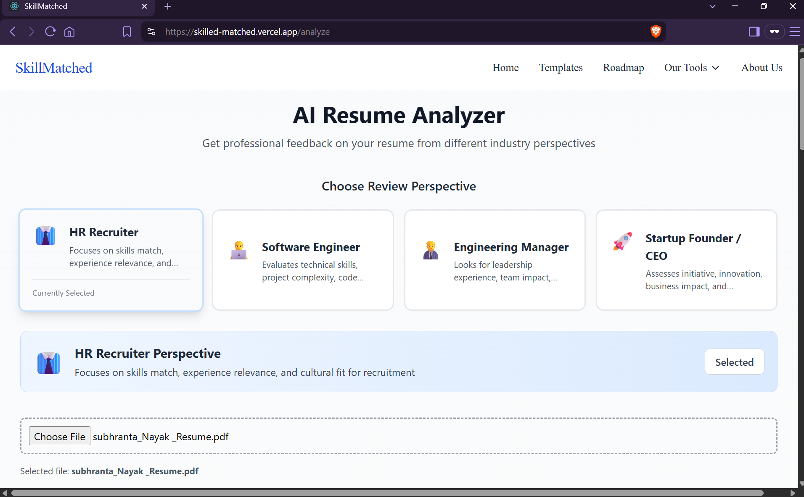
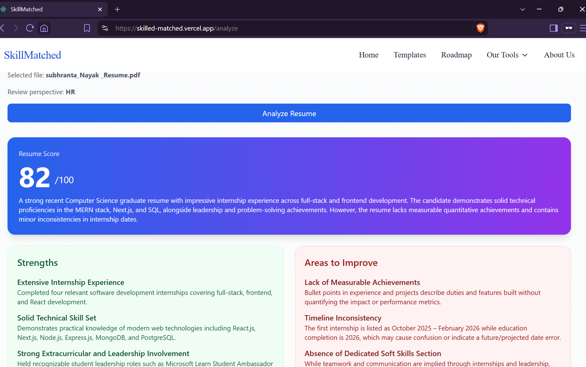

# 🧠 SkillMatched

SkillMatched is an AI-powered career assistant platform designed to help students, professionals, and job seekers improve their career growth through AI-driven resume analysis, job-role recommendations, and personalized learning roadmaps.

🌐 **Live Website:** [Visit SkillMatched](https://skillmatched.vercel.app)


---

## 🚀 Features

- 🎯 **AI Resume Analyzer**  
  Analyze your resume and understand its strengths, weaknesses, and improvement areas.

- 🔍 **Job Role Matcher**  
  Discover suitable job roles based on your skills, experience, and career interests.

- 🧭 **Learning Roadmaps**  
  Explore technical and non-technical career paths with structured learning tracks.

- 📄 **AI Resume Builder**  
  Generate professional resumes using structured user input and Gemini AI.

- 📝 **Cover Letter Generator**  
  Create professional, job-specific cover letters based on job descriptions.

- 📌 **Dashboard**  
  Manage your profile, resume information, and career-related activities from one place.

- 💡 **Career Guidance**  
  Future plans include skill assessments, interview preparation, and additional career tools.

---

## 📸 Screenshots

### AI Resume Analyzer



### Resume Analysis Results



---

## 🧑‍💻 How It Works

1. **Upload or Enter Resume Details**  
   Upload your resume or provide the required career information.

2. **Get AI-Powered Recommendations**  
   Receive resume feedback, suitable job roles, and personalized suggestions.

3. **Build Your Resume**  
   Enter your details and generate a professional resume.

4. **Explore Career Roadmaps**  
   Select a technical or non-technical career path and follow the recommended learning track.

---

## 📚 Roadmaps Included

### 🔧 Technical Roles

- Frontend Developer
- Backend Developer
- Full Stack Developer
- DevOps Engineer
- Data Scientist
- Cloud Engineer
- Cybersecurity Analyst
- Mobile App Developer
- AI/ML Engineer
- Blockchain Developer

### 🎨 Non-Technical Roles

- UI/UX Designer
- Product Manager
- Business Analyst
- HR Recruiter
- Digital Marketer
- Technical Writer
- Content Creator

---

## 🛠️ Tech Stack

### Frontend

- React.js
- Tailwind CSS
- Bootstrap
- JavaScript
- HTML5
- CSS3

### Backend

- Node.js
- Express.js
- REST APIs

### Database

- MongoDB
- Mongoose

### AI and Integrations

- Google Gemini API
- AI-powered resume analysis
- Resume parsing

### Tools and Deployment

- Git
- GitHub
- Postman
- VS Code
- Vercel
- Render

---

## 📂 Project Structure

```text
SkillMatched/
├── client/              # React frontend
├── server/              # Node.js and Express backend
├── screenshots/         # Project screenshots
├── .gitignore
└── README.md
```

---

## 🛠️ Project Status

🚧 **Currently in active development**

New features, improvements, and UI enhancements are being added regularly.

---

## 🔮 Upcoming Features

- Resume scoring and analysis history
- Job board integration
- AI interview assistant
- Advanced skill assessments
- Improved responsive design
- Personalized career recommendations

---

## ⚙️ Local Setup

### 1. Clone the Repository

```bash
git clone https://github.com/Subhranta703/SkilledMatched.git
cd SkilledMatched
```

### 2. Install Frontend Dependencies

```bash
cd client
npm install
```

### 3. Start the Frontend

```bash
npm start
```

The frontend will run at:

[http://localhost:3000](http://localhost:3000)

### 4. Install Backend Dependencies

Open another terminal and run:

```bash
cd server
npm install
```

### 5. Configure Environment Variables

Create a `.env` file inside the `server` folder:

```env
PORT=5000
MONGO_URI=your_mongodb_connection_string
GEMINI_API_KEY=your_gemini_api_key
JWT_SECRET=your_jwt_secret
CORS_ORIGIN=http://localhost:3000
```

> **Important:** Do not commit your `.env` file or expose API keys and database credentials.

### 6. Start the Backend

```bash
node index.js
```

The backend will run at:

[http://localhost:5000](http://localhost:5000)

---

## 👨‍💻 Made By

**Subhranta Kumar Nayak**

Frontend & Full Stack Developer | Community Leader

- GitHub: [Subhranta703](https://github.com/Subhranta703)
- Email: [skninfoo@gmail.com](mailto:skninfoo@gmail.com)

---

## 📄 License

This project is currently intended for educational and portfolio purposes.